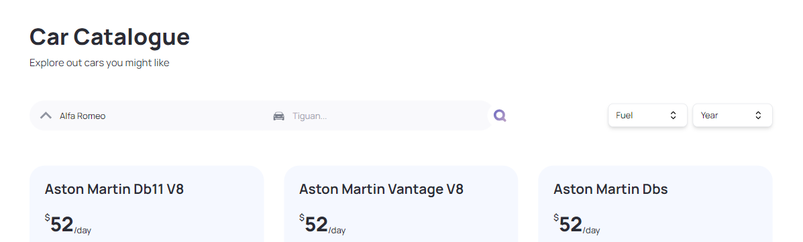

The Car Catalogue is a Next.js application with TypeScript for robust type-checking and Tailwind CSS for a sleek and modern design. This application provides a dynamic platform for browsing and managing a car catalogue. Users can easily explore a diverse range of cars with detailed information, and utilize advanced filtering options by model, year, and fuel type to find exactly what they're looking for. The application is designed with a responsive interface to ensure a seamless experience across all devices.

#### [View a live demo](https://nextjs-catalogue-with-tailwindcss-6ic0ap172.vercel.app/) of the Car Catalogue application

#### Getting Started

1. Get api key from [Rapid API](https://rapidapi.com/apininjas/api/cars-by-api-ninjas/pricing)
2. Run `npm install`
3. Run `npm run dev`
